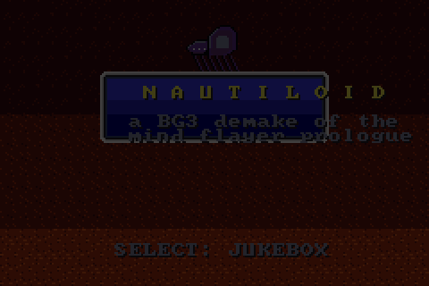

# Nautiloid — a GBA demake

A Game Boy Advance homebrew retelling of the opening mission of *Baldur's Gate 3*
("Escape the Nautiloid"): 16-bit-style tile exploration with FF4-Advance menus and
portraits, and **real D&D 5e SRD combat fought right on the map**, Chrono-Trigger
style — visible initiative rolls, actions and bonus actions, opportunity attacks,
and every d20 shown as it lands. A PSG chiptune score, all on a real 240×160 GBA
in about 15 minutes of play.

Everything here is **built from scratch**: no game engine, no devkitPro, no libgba,
no ripped assets. The toolchain is a stock `arm-none-eabi-gcc`; the sprites, tiles,
maps, and music are generated by Python scripts under `tools/`; the cartridge
header, startup code, and interrupt handler are hand-written.



## Play

```sh
make        # build build/nautiloid.gba
make run    # build and launch in mGBA
```

Requires `arm-none-eabi-gcc` and `arm-none-eabi-binutils` (e.g. `brew install
arm-none-eabi-gcc`), `python3`, and — for `make run` — `mgba`.

The ROM (`build/nautiloid.gba`) runs on mGBA, other accurate emulators, and real
hardware (a flashcart / EverDrive).

### Controls

| Button | Field | Battle / Menus |
|---|---|---|
| D-pad | Walk | Move cursor |
| A | Talk / examine / confirm | Confirm |
| B | — | Cancel / back |
| Start | Advance title, dismiss the ending | — |
| Select (title) | Jukebox | — |
| L (title) | Attract mode: the game plays itself | — |

Hold **A** or **B** to fast-forward dialogue text. In battle, the **Tactics**
command sets DQ-style AI per member — Orders, Wisely, All Out, Healer, No
Slots — so companions can fight themselves while you drive the hero.

## The mission

Wake in a pod aboard a mind flayer warship falling through Avernus. Choose who
you were before you were taken — **Bard, Rogue, Ranger, or Wizard** — then fight
your way to the helm before the ship crashes.

Faithful beats from the BG3 prologue, condensed into an FF4 dungeon:

- **The Nursery** — wake in a burst pod; a larva pool, a restoration device.
- **The Surgery** — free the brain of the dying elf Myrnath. It is a newborn
  intellect devourer; spare it and **Us** fights at your side (or mutilate it).
- **The Deck** — a red dragon strafes the hull; **Lae'zel** the githyanki joins
  you against a pack of imps.
- **The Ceremorphosis Chamber** — find the eldritch rune, slot it into the
  console, and *will* **Shadowheart's** pod open. Recruit her, or leave her.
- **The Helm** — **Commander Zhalk** duels a mind flayer while a transponder
  countdown ticks. Connect the nerves and escape — or kill Zhalk for the
  **Everburn Blade** first, if you can survive him.

Your choices — who you freed, who you saved, whether you took the blade — are
tallied over the wreckage on the Ravaged Beach.

Combat is SRD 5e for real: d20 + modifiers vs AC with the roll on screen,
advantage/disadvantage, crits that double dice, spell slots, concentration,
and class features at their real levels — Second Wind at fighter 1, Action
Surge at 2, sneak attack from Hide, Sleep as an HP-pool with auto-crits on
sleepers. Fights happen where you stand: initiative pops over every head, the
camera frames the brawl, melee dashes in, and enemies pick targets by expected
value (imps hunt your squishiest). Defeat offers an instant retry.

## How it's built

```
src/            bare-metal GBA C + the game
  crt0.s        cartridge header, stacks, section init, BIOS IRQ dispatch
  gba.h         MMIO register map
  video.c       Mode 0 background + brightness fades
  text.c        FF4 window chrome, word-wrapped typewriter dialogue, menus
  oam.c         sprite (OBJ) manager
  audio.c/.h    PSG tracker + SFX driver, ticked from VBlank
  field.c       tilemap rooms, grid walking, camera, NPCs, event triggers
  encounter.c   5e battles on the field map: initiative, action economy,
                dice display, opportunity attacks, DQ-style party tactics
  party5.c      5e character sheets for the party (SRD standard array)
  game.c        title, prologue crawl, class select, name entry
  events.c      the story: rooms, dialogue, cutscenes, the finale
  data.c        party stats, class kits, enemy definitions
rules/          pure C 5e SRD combat core -- dual-target: compiled into the
                ROM and natively for `make test-rules` (240k+ property checks,
                closed-form expectations validated against Monte Carlo)
tools/          Python asset pipeline (no binary art in the repo)
  mkassets.py   compiles art/music sources -> build/gen/assets.{c,h}
  mksrd.py      generates C tables from extracted SRD 5.1/5.2.1 data
  srd/          SRD data (CC-BY-4.0), homebrew monster overrides, invariants
  art/          tiles, field & battle sprites, room maps (ASCII pixel art)
  music/        original FF4-idiom chiptunes as note data
  fixrom.py     writes the Nintendo logo + header checksum (gbafix equivalent)
test/           headless mGBA test harness
  runner.c      libmgba driver: scripted input, screenshots, memory peek/poke
  scenario.py   deterministic full playthroughs for verification
gba.ld          linker script (ROM / IWRAM / EWRAM)
Makefile
```

### Verification

The game is validated by driving full playthroughs headlessly. `test/runner.c`
links against `libmgba`, injects controller input, and screenshots story beats;
a small in-ROM demo mode (auto-advancing dialogue, a poked choice buffer, and a
"field ready" flag the harness waits on) makes runs deterministic without
guessing frame counts. `test/scenario.py` encodes several branching paths
(different classes, sparing vs. mutilating Us, saving vs. abandoning Shadowheart,
connecting the transponder vs. killing Zhalk) that are run and screenshot-checked
end to end.

## Debug flags (CodeBreaker cheats)

The engine's demo flags live at fixed EWRAM addresses; mGBA's cheat interface
(Tools → Cheats, CodeBreaker format) can set them:

| Code | Effect |
|---|---|
| `3203FF00 0001` | Attract mode (same as L on the title) |
| `3203FF07 0001` | With attract on: dialogue auto-advances, battles stay manual |
| `3203FF02 0002` | Attract mode goes for the Zhalk kill at the helm |

## Credits

Original game *Baldur's Gate 3* © Larian Studios; *Final Fantasy IV* © Square
Enix. This is a non-commercial fan demake with all-original code, art, and music
— no assets from either game are used. The 8×8 text font is
[font8x8](https://github.com/dhepper/font8x8) by Daniel Hepper (public domain).
